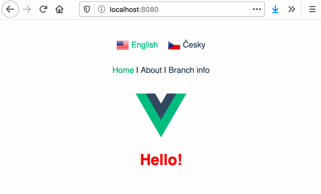

# :compass: &nbsp; Vue Language Router

Vue language routing with (optional) localized URLs.



Built on top of :vertical_traffic_light: [Vue Router](https://router.vuejs.org/) and :globe_with_meridians: [Vue I18n](https://kazupon.github.io/vue-i18n/).

## Features

:hourglass_flowing_sand: Asynchronous translation loading

:performing_arts: URL localization

:classical_building: Default language (no language prefix in URL)

:child: Supports variables and children in routes

:car: :bike: Supports both history and hash mode

:books: Sets user-preferred language on first visit

:memo: Loads last used language when visiting site again

:fast_forward: No extra router setup


## Installation


### Vue CLI plugin (recommended)

The easiest way to install Language Router is using [Vue CLI plugin for Language Router](https://github.com/radek-altof/vue-cli-plugin-lang-router#readme). The plugin will modify your router file, setup translation files and more.


### Manually

#### 1. Install Language Router

```sh
$ npm i vue-lang-router
```

#### 2. Create translations in your app.

> Note: This example uses Czech and English translations.

Example file structure:

```sh
src
└── lang
    └── translations
        ├── cs.json
        ├── en.json
        └── index.js
```

Create `JSON` files for all desired languages and reference them in `index.js`. Translations are loaded on demand.

```javascript
/*  src/lang/translations/en.json  */

{
  "hello": "Hello!",
  "about": {
    "example": "This is an About page."
  }
}
```

```javascript
/*  src/lang/translations/cs.json  */

{
  "hello": "Ahoj!",
  "about": {
    "example": "Tohle je stránka O nás."
  }
}
```

```javascript
/*  src/lang/translations/index.js  */

export default {
  en: {
    name: 'English',
    load: () => { return import('./en.json'); },
  },
  cs: {
    name: 'Česky',
    load: () => { return import('./cs.json'); },
  },
};
```


#### 3. Create localized URLs in your app.

> Note: Localized URLs are optional.

Example file structure:

```sh
src
└── lang
    └── localized-urls
        ├── cs.json
        └── index.js
```

Create `JSON` files for all desired languages and `import` them in `index.js`. Localized URLs need to be imported before router instantiation.

```javascript
/*  src/lang/localized-urls/cs.json  */

{
  "about": "o-nas"
}
```

```javascript
/*  src/lang/localized-urls/index.js  */

import cs from './cs.json';

export default { cs };
```


#### 3. Modify your router file

- Import `LangRouter` and use it instead of `VueRouter`.
- Import translations and localized URLs and pass them to `LangRouter` plugin.
- Create new router instance. All the options are the same as in `VueRouter`.

```javascript
/*  src/router/index.js  */

import Vue from 'vue';
import LangRouter from 'vue-lang-router';

import translations from '../lang/translations';
import localizedURLs from '../lang/localized-urls';

Vue.use(LangRouter, {
  defaultLanguage: 'en',
  translations,
  localizedURLs,
});

const routes = [ /* Your routes here */ ];

const router = new LangRouter({
  routes,
  mode: 'history',
});
```

#### 4. Modify your main file

Import `i18n` and use it in your `Vue` instance.

```javascript
import Vue from 'vue';
import App from './App.vue';
import router from './router';
import { i18n } from 'vue-lang-router';

new Vue({
  router,
  i18n,
  render: h => h(App),
}).$mount('#app');
```


## How to use

### Using translations

To use any translated string, use `$t('stringName')` in your code. For more information check out [`Vue I18n`](http://kazupon.github.io/vue-i18n/).


### Using links

Use `<localized-link>` component. It localizes given path based on current language.

It accepts the same options as `<router-link>`.

```html
<localized-link to="/user/john-smith">John Smith</localized-link>
```


### Switching language

Use `<language-switcher>` component for this. The component will loop over all available languages and generate `links` array with properties, which you can use to create your own menu.

The wrapper element will have `router-language-switcher` class.

#### Examples:

```html
<language-switcher v-slot="{ links }">
  <router-link :to="link.url" v-for="link in links" :key="link.langIndex">
    
    <span>{{ link.langName }}</span>
  </router-link>
</language-switcher>
```

```html
<language-switcher v-slot="{ links }" tag="ul" active-class="my-custom-class">
  <li :class="link.activeClass" v-for="link in links" :key="link.langIndex">
    <a :href="link.url">{{ link.langIndex }}</a>
  </li>
</language-switcher>
```

#### Properties:

-  **url** : The localized path to the current/specified page in iterated language.
- **langIndex** : The index of the iterated language provided in `translations`.
- **langName** : The name of the iterated language provided in `translations`.
- **activeClass** : Returns the active class when iterated language equals current language, otherwise empty.


#### Accepted attributes:

- **tag** : Use this attribute to specify which tag should be used as a wrapper element. The default is `div`.
- **url** : Provides a specific path to generate translation links for. If omitted, current path is used.
- **active-class** : Defines the name of class to provide when language of the link equals current language. The default is `router-active-language`.